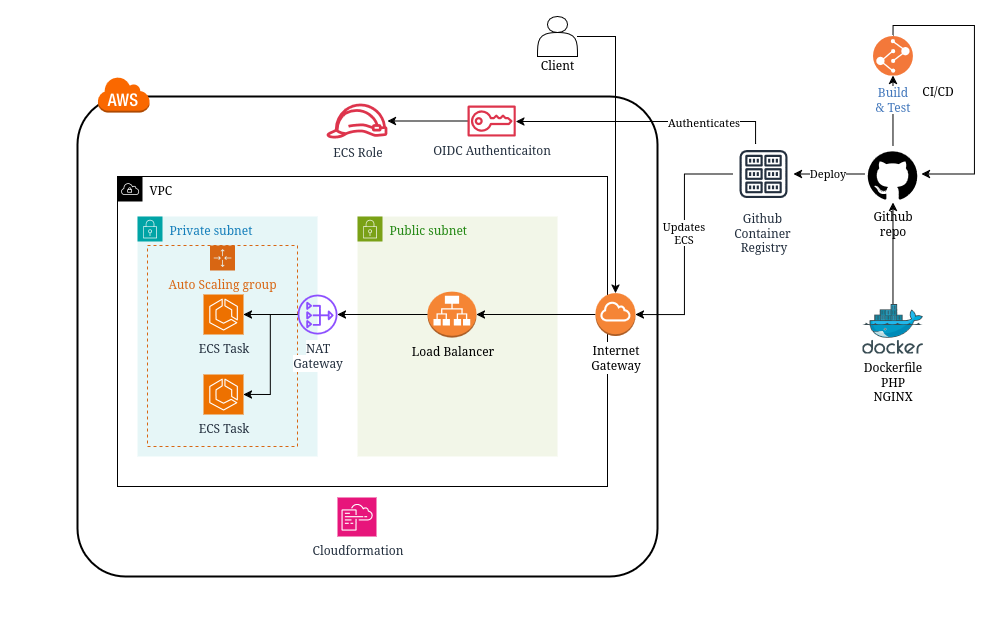

# PHP + NGINX WEB DEMO

A webpage that displays a simple php.info. Stack can be automatically deployed to ECS.

## HLD

## Features
- Cloudformation template
- Automatic build and deployment to AWS

## Installation

LOCAL
------
Clone the repository and run docker compose:

<!-- We are not pulling images directly to avoid conflict when build is in the process -->
<pre>
git pull https://github.com/artyomprima-cloud/DrumNcode.git
docker pull ghcr.io/artyomprima-cloud/nginx:latest
docker pull ghcr.io/artyomprima-cloud/php-app:latest
docker tag ghcr.io/artyomprima-cloud/php-app:latest php-app:local
docker tag ghcr.io/artyomprima-cloud/nginx:latest nginx:local
docker compose up
</pre>

AWS
-----
1. Go to CloudFormation.

2. Click Create stack → With new resources (standard).

3. Under Specify template, choose one of: Upload a template file → cfn-task-definition.yml

4. Click Next.

5. Enter a Stack name (e.g., MyAppStack).

6. Pick only 2 different subnets.

7. Click Next to configure stack options

8. Click Next again, review everything.

9. Click Create stack.

